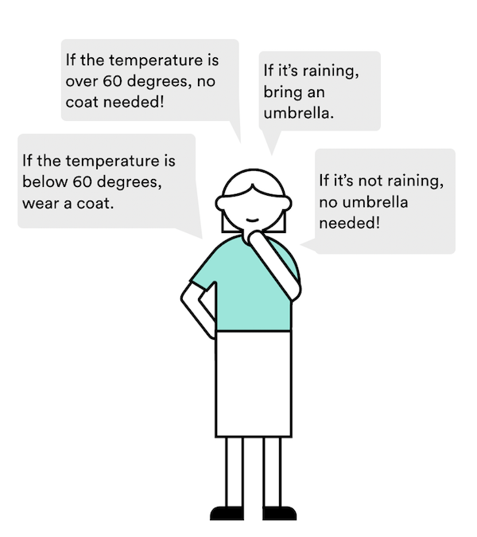
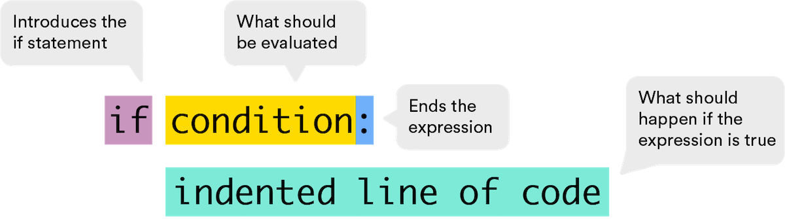
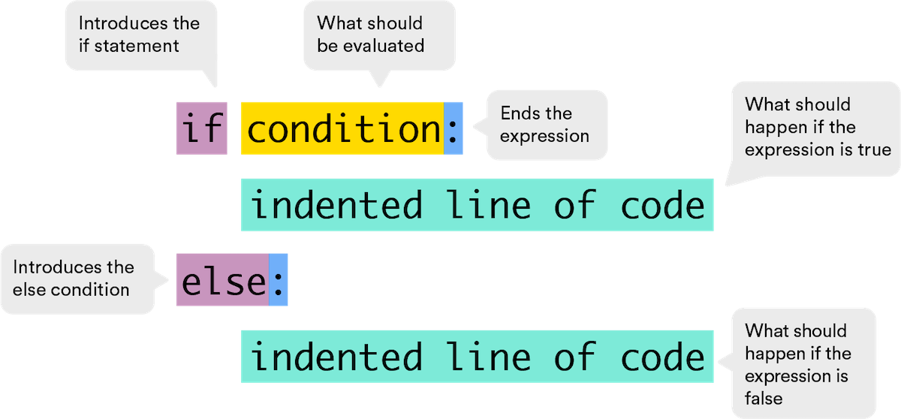
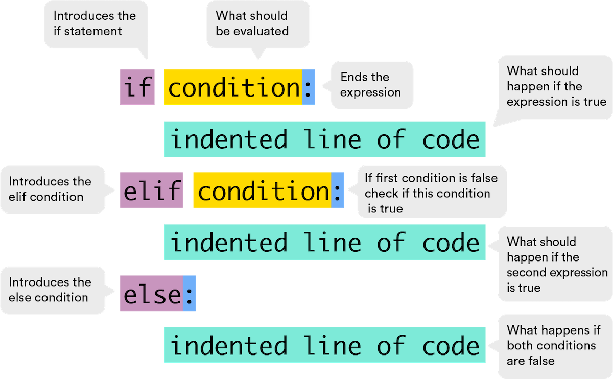
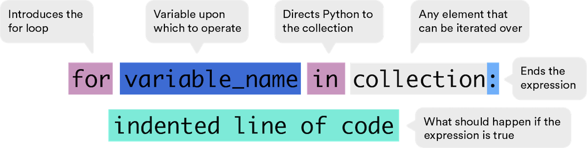
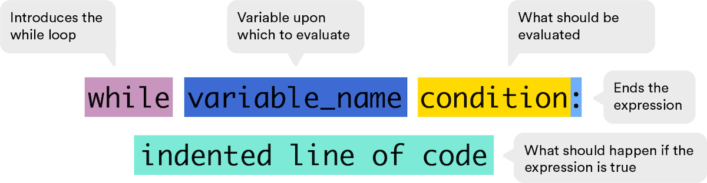

# 

## Control Flow in Python ( 30 min )

Who doesn't love a good flowchart? It has colors, shapes, arrows — and most importantly, it provides visual representations of a workflow or process that contains several steps in a particular order. In Python, we use something similar called control flow, and it's a critical component of just about any program ever written. In this lesson, you'll learn why control flow is important and how to utilize it in your programs.

## Topics

- Control Flow
- if-else Statements
- Loops

### **Learning Objectives**

By the end of this lesson, you'll be able to:

- Explain why control flow is an important concept in programming.
- Write loops and conditional statements in Python to control the flow of a program.

## Introduction to Control Flow

<a href="https://generalassembly.wistia.com/medias/8r655u7t7r?wvideo=8r655u7t7r"></a>

_Transcript_

_Are you stuck in a rut? If you're doing the same thing over and over again, you may need to ask, "Are you stuck in a rut?" If you’re doing the same thing over and over again, you may need to ask, "Are you stuck in a rut?" If you’re doing the same thing over and over again, you may need to ask ..._

_This was me before I learned about control flow. Control flow is what keeps our programs from doing the same thing every single time. It tells our programs what to do based on different conditions. Let's take a look at control flow in action._

_First, we look out the window. Then, we ask ourselves, "Is it raining?" If no, then we'll go outside and enjoy the weather. If yes, it is raining, then we have to stay inside, watch more Netflix, and check back in an hour._

_This flowchart highlights two key players of program flow: conditionals and loops. In the flowchart, the question "Is it raining?" is an expression that evaluates to either true or false. True: It is raining. False: It is not._

_The left side of our flowchart — "It is not raining, then go outside" — is called a conditional. The right side of our flowchart is a loop. Yes, it is raining, so we'll watch Netflix for another hour and check again later. We'll do this until we can finally answer, "No, it's not raining."_

_Even though it's one of the critical constructs of programming, control flow doesn't have to be complicated. In fact, when broken down into its component parts, we might even say it's simple._

_Can I go outside yet? Please?_

## How Do Computers Know Which Decisions to Make?

To tell the computer how to "decide" what to do, we use **comparison** statements. Comparison statements always boil down to a single boolean value: `true` or `false`.

To write these statements in programming, we use what are called **comparison operators**.

| Operator | Functionality                                         | Example   |
| -------- | ----------------------------------------------------- | --------- |
| `>`      | Greater than                                          | `5 > 2 `  |
| `>=`     | Greater than or equal to                              | `5 >= 5`  |
| `<`      | Less than                                             | `2 < 200` |
| `<=`     | Less than or equal to                                 | `1 <= 72` |
| `==`     | Tests if the left and right sides have equal values   | `5 == 5`  |
| `!=`     | Tests if the left and right sides have unequal values | `3 != 5`  |

## Conditional Statements

Comparisons are important, but they're not that meaningful in isolation. You don't need a computer program to tell you that `100 > 4`.

The real power of comparisons lies in their use in **conditional statements** to control what, when, and how things happen in your program.

You do this all the time in real life. When you're getting ready in the morning, you decide what to wear based on whether a condition is true or false (e.g., it's going to be higher than 60º; it's going to be lower than 60º).



<br>

## Writing Conditional Statements in Python

So how do we write conditional statements in Python? We use the `if` statement.

Every `if` statement must begin the line with `if`, followed by **any expression**, followed by a **colon**, then one or more **indented lines of code**:



We evaluate the indented lines of code only if the expression (converted to a `bool`) is `True`. You can think of this as, "If the expression is `True`, then evaluate the indented code."

**Pro Tip:** According to [PEP 8](https://www.python.org/dev/peps/pep-0008/), lines should be indented using four spaces.

## Try it out in Repl.it!

Create a new [Repl.it](https://replit.com/new/python3) for this lesson called `Control_Flow_In_Python`. As you go through this lesson, try out the examples in your Repl to see how they work.

## A Weather-Related Example

Let's write one of the statements from the earlier example:

"If the chance of rain is greater than 50 percent, then I'll wear a raincoat."

```python
if chance_of_rain > 0.5:        # if <expression>:
    print("wear a raincoat")    # <indented line of code>
```

This code is evaluated line by line, from top to bottom. If `chance_of_rain > 0.5` evaluates to `True`, then the indented lines will run. If the statement is `False`, we skip the indented lines of code.

### Try it out in Repl.it!

```python
chance_of_rain = 0.8  # Change this value to test different outcomes

if chance_of_rain > 0.5:
    print("Wear a raincoat")
```

## Combining Conditional Statements

Conditional statements are powerful, but we can dial up the power by combining conditional statements using **logical operators**.

By combining conditional statements, we're asking the computer to evaluate more than one condition.

For example:

- If it's going to be lower than 60º **_and_** raining, wear a raincoat.
- If it's going to be higher than 60º **_and_** raining, bring an umbrella.
- If it's going to be lower than 60º **_or_** windy, wear a sweater.

| Operator | Functionality                                        | Example                  |
| -------- | ---------------------------------------------------- | ------------------------ |
| `and`    | Evaluates to `true` if both statements are true      | `x > 10 and x < 20`      |
| `or`     | Evaluates to `true` if one of the statements is true | `x < 10 or x > 20 `      |
| `not`    | Evaluates to `true` if the result is false           | `not(x > 10 and x < 20)` |

### Try it out in Repl.it!

```python
# Change these values to test different outcomes

temperature = 55
raining = True

if temperature < 60 and raining:
    print("Wear a raincoat")
```

## Creating Conditions With if-else

<a href="https://generalassembly.wistia.com/medias/e2o7ey38w6?wvideo=e2o7ey38w6"></a>

_Transcript_

_Comparison and logical operators allow us to create what we call conditions — a circumstance that we define. For example, weather reports are filled with them. "Chance of rain is greater than 50 percent" is a condition._

_This sign is a comparison operator. We use conditions to create conditional statements, which are statements that allow us to determine a course of action based on a condition._

_We use these all the time in the real world. Going back to the weather example, I could say, "If the chance of rain is greater than 50 percent, then I'll wear a raincoat. If the chance of rain is less than 50 percent, then I'll wear a light cardigan." This is an example of an if statement._

_We can also combine conditional statements to express them in one go. For example, "If the chance of rain is greater than 50 percent, then I'll wear a raincoat. Otherwise, I'll wear a cardigan." These kinds of statements are called if-else statements. Else represents the otherwise part of a conditional statement by letting us specify the code that should be executed if the condition we laid out is false._

## The else Condition

Sometimes, we want to evaluate one block of code if the expression is `True` and another block of code if it's `False`.

For example, we said: "If the chance of rain is greater than 50 percent, then I'll wear a raincoat. Otherwise, I'll wear a cardigan."

This is called an `if-else` statement.



<br>

## Back to our Weather-Related Example

This code is evaluated line by line, from top to bottom.

```python
if chance_of_rain > 0.5:        # if <expression>:
    print("wear a raincoat")    # <indented line of code>
else:
    print("wear a cardigan")    # the else statement
```

If `chance_of_rain > 0.5` evaluates to `True`, then the first indented line will run. If the statement is `False`, we skip the first indented line and evaluate the second line of indented code.

### Try it out in Repl.it!

```python
chance_of_rain = 0.4  # Change this value to test different outcomes

if chance_of_rain > 0.5:
    print("Wear a raincoat")
else:
    print("Wear a cardigan")

```

## Conditions on Conditions on Conditions

Conditionals don't stop there, my friend. If you need a conditional to check for **more than two** possibilities, you can add more comparisons to create an `if ... else if ... else` chain, as shown below. This is called an `elif` statement.

`elif` statements tell Python, "If something is true, do this. If not, check the next condition in the chain."

The first conditional that turns out to be `True` is executed, and the rest of the chain is skipped entirely.



<br>

## These Can Get Long

`elif` statements always have one `if`, as many `elifs` as you want, and zero to one `else`.

Recall that in an `elif` chain, once the computer finds a `True` condition, it skips the rest of the chain.

### Try it out in Repl.it!

```python
inspection_score = 85  # Change this value to test different outcomes

if inspection_score >= 90:
    print("Excellent! Your restaurant is in top condition.")
elif inspection_score >= 80:
    print("Great job! Your restaurant meets high standards.")
elif inspection_score >= 70:
    print("Good effort! Your restaurant meets acceptable standards.")
elif inspection_score >= 60:
    print("Needs improvement! Your restaurant has several issues to address.")
else:
    print("Unsatisfactory! Your restaurant did not pass the inspection.")
```

## Wait. What's This Lesson About Again?

This lesson is about control flow. Don't worry, we're getting there.

You may have noticed that when we wrote the `if` and `if-else` statements, the computer is always able to make informed decisions based on your code. As it evaluates the statements from top to bottom, it skips any indented code whenever our expression isn't met.

This is control flow. We're controlling how the program reads and executes code. Anytime we want a program to **_decide_** what to do, we write conditional statements.

Int eh next section, we'll talk about what to do when we want a program to **_repeat_** a specific behavior.

## Introducing Loops

Just when you thought we couldn't have any more fun, we introduce you to loops!

Whenever you want a program to repeat a conditional process, you can create a loop. A loop will continue to execute **as long as** a certain condition is met.

We'll cover two kinds of loops: `for` loops and `while` loops. They both get the job done, but there are certain situations that make the most sense for each kind.

## The for Loop

`for` loops are generally used when you want a process to repeat **for** a fixed number of times. (Get it?)

The `for` loop always requires the following structure:



<br>

The `variable_name` can be anything as long as it isn't another one of your variable names.

The `collection` is any element that can be iterated over. For example, lists, strings, tuples, dictionaries (the keys), and sets (in no particular order).

**Reminder:** Notice how a colon always indicates that at least the next line of code will be indented.

## for Loop Example

In this example, we're asking Python to sum the integers in the list:

```python
total = 0                           # Line 1

for num in [0, 1, 2, 3, 4, 5]:      # Line 2
    total += num                    # Line 3

print(total)                        # Line 4
```

To start, `total` is `0`.

In Line 2, `num` is set to `0`, which is the first element in the list.

In Line 3, `total = total + num`, so `total = 0 + 0`. **Note:** `total += num` is the same as `total = total + num`.

At the end of the code block, `total` is `0`.

We loop back to Line 2. Now, `num` is set to the second element, `1`. In Line 3, `total = total + num`, so `total = 0 + 1`.

Once the `for` loop is done, we see that `total` is `15` (`0` + `1` + `2` + `3` + `4` + `5`), as expected.

**Pro Tip:** Python's built-in `sum()` function accomplishes the same objective as the `for` loop above.

### Try it out in Repl.it!

```python
total = 0

for num in [0, 1, 2, 3, 4, 5]:
    total += num

print(total)  # Should print 15
```

## Another for Loop Example

Let's look at one more example of a for loop.

Copy the following code into **Repl.it** and click the "Run" button to see the code in action before reading through the explanation provided below.

```python
primes = [2, 3, 5]             # Line 1

for prime_number in primes:    # Line 2
    print(prime_number)        # Line 3

print('Done!')                 # Line 4
```

So, what just happened?

In this example, `prime_number` is an arbitrarily chosen name — it could just as easily be `prime` or even `x`. Each time we loop, this variable references the next element in `primes` until none are left.

When Line 2 is evaluated, `prime_number` is set to the first element of `primes`: `primes[0]`. Effectively, it sets `prime_number = primes[0]` (reminder: index `0` is the number `2` in this list). Because Line 3 is indented, it's evaluated next and `prime_number` (i.e., `primes[0]` aka `2`) is printed.

Now, we loop back to Line 2. Here, `prime_number` is set to the next element of `primes`: `primes[1]`. On Line 3, we print `prime_number` again.

This continues until we loop back to Line 2 and we've iterated through each element in `primes`. At this point, the `for` loop is done and we jump to the next line after the code block, which is Line 4.

## Home on the range() Function

It was a bit tedious writing out that list of integers from zero to five, wasn't it?

```python
total = 0

for num in [0, 1, 2, 3, 4, 5]:  # the hard way
    total += num

print(total)
```

What if we wanted to sum a list of 100 integers? That would be an even bigger hassle. Thankfully, Python provides us with a built-in function, `range()`, that does this for us.

`range(N)` creates a generator of integers from `0` up to but not including `N`. So, to sum the first five integers, we must set `N` to `6`.

### Try it out in Repl.it!

```python
total = 0

for num in range(6):  # Using range()
    total += num

print(total)  # Should print 15
```

## More range()

The `range()` function takes three arguments: `range([start,] stop [,step])`. The only required argument is the stopping value.

If you want to start at any number other than `0` and want a difference between each list result other than `1`, you can specify the optional arguments `start` and `step`.

So, if we wanted Python to print all odd numbers between `5` and `15`, our `range()` function would look like this: `range(5, 15, 2)`.

## The while Loop

Let's meet the simpler, cleaner cousin of the `for` loop: the `while` loop.

A `while` loop is generally used in Python when we don't know when the looping will stop or how many iterations the loop will require.



<br>

That's right, there's just one part of a `while` loop: the conditional. As long as the conditional is true, the loop will keep going forever, and ever, and ever, and ever...

## Playing With User Input

Let's make while statements even more fun.

Meet `input()`, another exciting built-in Python function. It prompts the user for a text input and then returns that input as a string.

### Try it out in Repl.it!

```python
name = input('What is your name?')

print(name)
```

Here, the user is prompted in the console with `What is your name?`. If the user enters `Petunia`, then the `name` variable is set to the string `"Petunia"`.

Here's a helpful way of reading code with function calls: Replace the entire function call (in this case, `input('What is your name?')`) with its return value. Thinking about it this way, the statement becomes `name = "Petunia"`.

## The while Loop With User Input

Here's an example of the while loop in action:

```python
print('Type "yes" to continue.')                          # Line 1

while input('Do you want to quit the loop?') != 'yes':    # Line 2: While the user does not enter 'yes', repeat.
    print('Please type "yes" so we can exit this loop.')  # Line 3

print('Thank you for typing "yes."')                      # Line 4
```

Here, we're asking Python to continue to loop while the user's input doesn't equal `yes`. Let’s walk through this example.

To perform the comparison, we first evaluate `input('Do you want to quit the loop?') != 'yes'`. (Recall: `!=` means "not equal to.")

Suppose the user enters `'no'`. Then, by replacing the function call in its entirety with `'no'`, we get `'no' != 'yes'`. This is `True`, as `'no'` is not equal to `'yes'`.

## Another while Loop

Let's look at another example of a while loop:

```python
counter = 0                                                         # Line 1

while counter < 10:                                                 # Line 2
    print('counter is currently', counter)                          # Line 3
    counter += 1                                                    # Line 4

print("We're out of the loop. The value of counter is", counter)    # Line 5
```

Here, we're creating a while loop using the `counter` variable.

On Line 1, we're starting `counter` off at `0`.

We then evaluate if `counter` is less than `10` (Line 2). Because `0` is less than `10`, Lines 3 and 4 are run.

Line 3: We simply print the current value of `counter`.
Line 4: We then increment the value of `counter`. Note: `counter += 1` is short for `counter = counter + 1`.
Once `counter` is equal to `10`, the loop will break, as `10` is not less than `10`.

### Try it out in Repl.it!

```python
counter = 0

while counter < 10:
    print('counter is currently', counter)
    counter += 1

print("We're out of the loop. The value of counter is", counter)
```

## Review

We can write more advanced (read: useful) programs by asking the computer to make decisions.

We're basically communicating with computers when we write conditional statements and loops. "Hey, if this condition is met, do this. If not, do this other thing."

| Operator | Functionality                                         | Example   |
| -------- | ----------------------------------------------------- | --------- |
| `>`      | Greater than                                          | `5 > 2 `  |
| `>=`     | Greater than or equal to                              | `5 >= 5`  |
| `<`      | Less than                                             | `2 < 200` |
| `<=`     | Less than or equal to                                 | `1 <= 72` |
| `==`     | Tests if the left and right sides have equal values   | `5 == 5`  |
| `!=`     | Tests if the left and right sides have unequal values | `3 != 5`  |

### `if` Statement

```python
if <expression>:
    <indented line of code>
```

### `if` With an `else` Clause

```python
if <expression>:
    <indented line of code>
else:
   <indented line of code>
```

### `for` Loop

```python
for <variable name> in <sequence>:
    <indented line of code>
    ...
```

### `while` Loop

```python
while <variable_name> condition:
    <indented line of code>
```

<br>

<hr>
<a href="./assets/control-flow-in-python.pdf" target="_blank" download="control-flow-in-python.pdf" class="ant-btn" data-trackable="true" data-track-category="study guide" data-track-section="lesson page" data-track-action="download study guide"><span role="img" class="anticon"><svg viewBox="0 0 16 16" width="1em" height="1em" fill="currentColor" aria-hidden="true" focusable="false" class=""><g class="download_svg__nc-icon-wrapper"><path d="M8 12c.3 0 .5-.1.7-.3L14.4 6 13 4.6l-4 4V0H7v8.6l-4-4L1.6 6l5.7 5.7c.2.2.4.3.7.3z"></path><path data-color="color-2" d="M1 14h14v2H1z"></path></g></svg></span><span> Download Study Guide</span></a>

<br>
