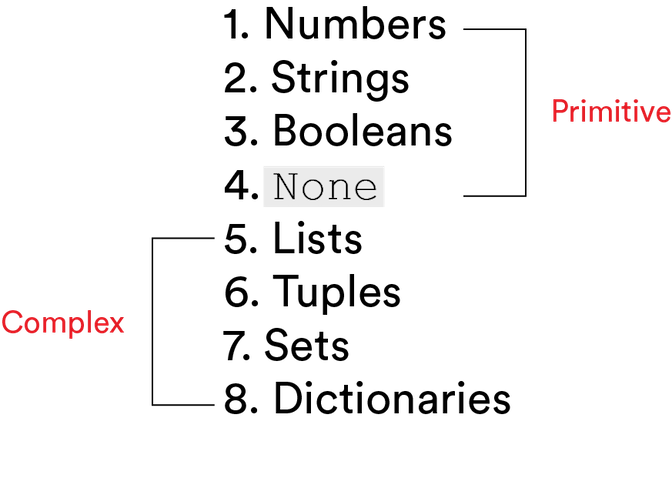
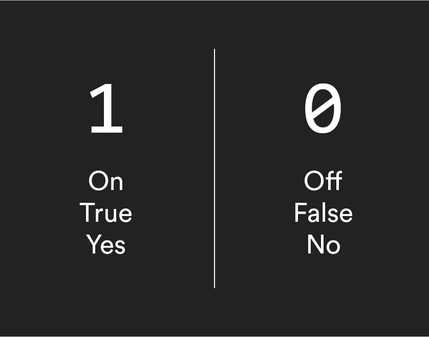

# 

## Data Types in Python ( 25 min )

By the time we get to preschool, all of us have learned that numbers and words are used in different contexts and that they convey different information. That knowledge means that even 3 year olds don’t say nonsensical sentences like, "I want horse more 6s." Computers, however, need a little extra help to tell the difference between letters and numbers so they can read and communicate information successfully. In this lesson, we’ll find out how we can provide that "extra help."

## Topics

- Data Types
- Numerical Operators
- Converting Data Types

### **Learning Objectives**

By the end of this lesson, you'll be able to:

- Define primitive Python data types and their common use cases.
- Manipulate data using numerical operators.
- Convert data types.

## Binary and Data Types

In a computer, everything is stored in binary as 1s and 0s, but any combination of 1s and 0s can be interpreted in multiple ways. Depending on how the sequence `01000001` is read, it can represent either the integer `65` or the character `'A'` — and one of those isn’t a particularly useful way to represent someone’s age.

Clearly, we need a way of telling the computer how to read the sequence. That’s where **data types** come in. By telling the computer the data type, we’re helping it determine the meaning of the data, the possible values for that data, and the operations that can be performed on those values!

Oh, and don’t worry, data types are pretty similar across programming languages, so you can just apply the same base knowledge of data types in Python to whatever language you’re using.


<br>

## Python’s Data Types

In this lesson, we’ll explore the "primitive data types," which are the first four items in Python’s complete list of built-in data types, shown here:



<br>

Data types 5–8 are little more complex, so we’ll save those for a later lesson.

## Try it out in Repl.it!

Create a new [Repl.it](https://replit.com/new/python3) for this lesson called `Data_Types_In_Python`. As you go through this lesson, try out the examples in your Repl to see how they work.

## Integers and Floats

The first of the primitive data types is **numbers**, which can be divided (ba-dum tsss) into several subgroups.
Today, we’ll just talk about the two most popular: integers and floats.

- **Integers** are whole numbers with an optional positive `+` or negative `-` prefix. For example, `3`, `82`, `38218`, `+3`, `-71` are all integers.
- **Floats** are basically decimals. Any number containing a decimal point, whether positive or negative, is interpreted as a float (e.g., `0.32`, `.32`, `83.7823`, `1.00`, `-5.45`).

Fun fact! In Python, decimal numbers are stored using scientific notation. If you’ve forgotten what that means since you last took a math class, basically larger numbers like `3500.0` are stored as `3.5 x 10^3`. The position of the decimal place "_floats_" backward and forward as the exponent changes, hence the name.

### Try it out in Repl.it!

```python
# Let's try defining some integers and floats
my_int = 5
my_float = 3.14

print("Integer:", my_int)
print("Float:", my_float)
```

## What Do We Do With Numbers?

In Python, programmers perform equations with data by using numerical operators, which include `+`, `-`, `*`, `/`, `//`, and `%`.

Some of these operators are the familiar ones we’ve all known and loved since elementary school, but some are unique to programming!

| Operator | What Does It Do?                                                |
| -------- | --------------------------------------------------------------- |
| `+`      | Addition                                                        |
| `-`      | Subtraction                                                     |
| `*`      | Multiplication                                                  |
| `/`      | Float division                                                  |
| `//`     | Integer division                                                |
| `%`      | The modulo is used to get the remainder of a division equation. |

### Try it out in Repl.it!

```python
# Try some arithmetic operations
a = 10
b = 3

print("Addition:", a + b)
print("Subtraction:", a - b)
print("Multiplication:", a * b)
print("Float Division:", a / b)
print("Integer Division:", a // b)
print("Modulo:", a % b)
```

## Booleans

The next data type is the **Boolean**, which holds the distinguished title of "most fun data type to say out loud." (Sorry, tuple. Better luck next year.)

Boolean variables have one of two possible values: `True` or `False`. Appropriately, they’re also often called **flags**, as they flag whether or not something is present.

Internally, they are stored as integers: `1` if `True` and `0` if `False`.



<br>

### Try it out in Repl.it!

```python
# Define some Boolean values
is_happy = True
is_sad = False

print("Is Happy:", is_happy)
print("Is Sad:", is_sad)
```

## Strings

**Strings** are collections of letters and symbols known as "characters." They are typically used to store text for people to read.

For example:

- `first_name = 'Charles'`

- `org_city = 'Singapore'`

- `brand_name = 'adidas'`

To indicate a string in Python code, simply enclose it with either ‘single’ or "double" quotation marks. If your string contains a single quote, like `diner_name = "Sandy's"`, then enclose it with double quotes, and vice versa.

### Try it out in Repl.it!

```python
# Define some strings
first_name = 'Charles'
org_city = "Singapore"
brand_name = 'adidas'

print("First Name:", first_name)
print("City:", org_city)
print("Brand:", brand_name)
```

Pretty easy, right?

## Can We Use Numerical Operators on Strings?

You might not think it’s possible to use numerical operators on a string containing letters, but you can!

The `+` operator concatenates, or combines, two strings together to make one big string.

So, `'a' + 'b'` evaluates to `'ab'`.

The other operator that works on strings is the `*`. It does exactly what you might expect it to do (how refreshing!) and returns the string as many times as you multiply it by.

For example, `'hello'*3` will give us `"hellohellohello"`!


<br>

### Try it out in Repl.it!

```python
# Try some string operations
greeting = 'Hello'
name = 'Alice'

print("Concatenation:", greeting + ' ' + name)
print("Repetition:", greeting * 3)
```

## Escape Characters

**Escape characters** are characters with special meanings, and they’re represented by a backslash followed by a character.

Escape characters are _not_ a data type, but you’ll still likely see them in strings. Most commonly:

| Escape Character | Definition          | Sample Code            | Sample Output                      |
| ---------------- | ------------------- | ---------------------- | ---------------------------------- |
| `\n`             | Creates a new line. | `'Line One\nLine Two'` | Line One<br>Line Two               |
| `\t`             | Indents text.       | `'\t -Bullet 1'`       | &nbsp;&nbsp;&nbsp;&nbsp; -Bullet 1 |

There will be times when we want Python to print out a good old-fashioned backslash instead of reading it as an escape character. To do so, just write `\\`.

### Try it out in Repl.it!

```python
# Try using escape characters
print("Line One\nLine Two")
print("Indented:\tThis is indented")
print("Backslash: \\")
```

## None

The last of the primitive data types we’ll cover is `none`. This data type represents a null value, or the absence of data, and it is _not_ interchangeable with `0`.

Let’s see why.

Say you have a data set that contains the names of pets at a veterinary practice (or are they "patients"?), along with their weights and ages. If there is no record of a pet’s weight, then this would be represented by `none`, not `0`, because Kevin the Chihuahua doesn’t weigh zero pounds — even if he might be close.

### Try it out in Repl.it!

```python
# Define a variable with None
pet_weight = None

print("Pet Weight:", pet_weight)
```

## Data Types Summary

| Data Type | What It Is                                                 | Example                             | What Is It Used For?                                                |
| --------- | ---------------------------------------------------------- | ----------------------------------- | ------------------------------------------------------------------- |
| Integer   | A whole number, either positive or negative.               | `+37`, `8`, `-100387`               | Used for calculating or counting.                                   |
| Float     | Any number containing a decimal point.                     | `0.32`, `83.7823`, `-5.45`          | Used for calculating or counting.                                   |
| Boolean   | Handles true or false values.                              | `True` or `False`                   | Used when there are two options for a value.                        |
| String    | A collection of letters and symbols known as "characters." | `'Charles'`, `"Singapore"`, `'cat'` | Used when working with any text wrapped in single or double quotes. |
| None      | The absence of a value.                                    | `none`                              | Defines a null value.                                               |

## Data Type Conversions

More often than not, we (sadly) won’t have control over the integrity of the data with which we’re working.
Instead, we get the data we get and then figure out how to work with it.

For instance, we may be given a data set that stores numbers as strings. So, before we can perform calculations on that data, we’ll need to convert the data type.

To do this, we use built-in functions like the following:

- float()
- int()
- str()

Let’s see this in action.

Say our data set stores the number `"1"` as a string. To convert it to an integer, we would write:

```python
int('1')
```

### Try it out in Repl.it!

```python
# Try converting data types
num_str = "123"
num_int = int(num_str)
num_float = float(num_str)

print("String to Integer:", num_int)
print("String to Float:", num_float)
```

## Review

Just as we do when we speak, we need to distinguish between different types of information when we use programming languages. By using data types, we can tell the computer how to read and interpret information.

Programmers can manipulate the data as they need, for instance adding and subtracting numbers or concatenating strings. Using built-in functions, we can also convert data from one data type to another. Not too shabby for something so simple!

As an added bonus, data types are pretty similar across different programming languages. That means that, now that you are in the know, you should be able to quickly apply this same knowledge to most other languages. Way to go!

| Data Type | What It Is                                                 | Example                             | What Is It Used For?                                                |
| --------- | ---------------------------------------------------------- | ----------------------------------- | ------------------------------------------------------------------- |
| Integer   | A whole number, either positive or negative.               | `+37`, `8`, `-100387`               | Used for calculating or counting.                                   |
| Float     | Any number containing a decimal point.                     | `0.32`, `83.7823`, `-5.45`          | Used for calculating or counting.                                   |
| Boolean   | Handles true or false values.                              | `True` or `False`                   | Used when there are two options for a value.                        |
| String    | A collection of letters and symbols known as "characters." | `'Charles'`, `"Singapore"`, `'cat'` | Used when working with any text wrapped in single or double quotes. |
| None      | The absence of a value.                                    | `none`                              | Defines a null value.                                               |

<br>

<hr>

<a href="./assets/data-types-in-python.pdf" target="_blank" download="data-types-in-python.pdf" class="ant-btn" data-trackable="true" data-track-category="study guide" data-track-section="lesson page" data-track-action="download study guide"><span role="img" class="anticon"><svg viewBox="0 0 16 16" width="1em" height="1em" fill="currentColor" aria-hidden="true" focusable="false" class=""><g class="download_svg__nc-icon-wrapper"><path d="M8 12c.3 0 .5-.1.7-.3L14.4 6 13 4.6l-4 4V0H7v8.6l-4-4L1.6 6l5.7 5.7c.2.2.4.3.7.3z"></path><path data-color="color-2" d="M1 14h14v2H1z"></path></g></svg></span><span> Download Study Guide</span></a>

<br>
