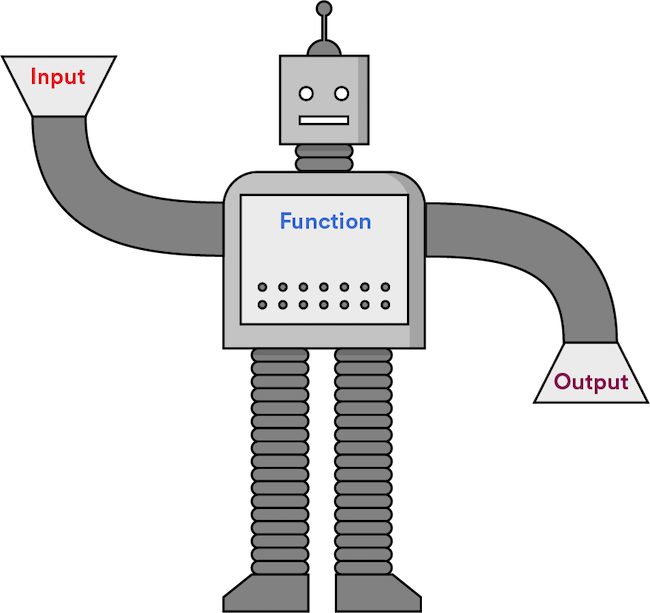
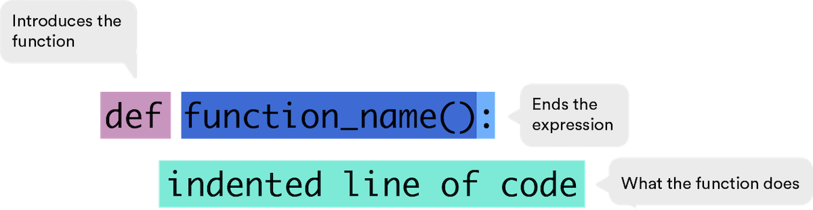
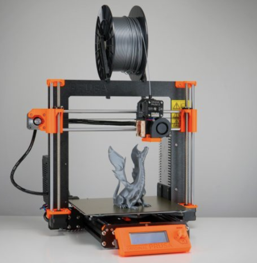

<h1>
  <span class="headline">Python Pre-Work</span>
  <span class="subhead">Functions in Python</span>
</h1>

## Functions in Python ( 45 min )

Functions are extremely powerful tools in programming. They can tell your computer to do something — anything — which comes in handy when you need a computer to perform the same action multiple times. In this lesson, we’ll explore the wonderful world of Python functions and how to put them to use.

## Topics

- Functions and Their Purposes
- Function and Keyword Arguments
- Returning Values
- Calling Functions

### **Learning Objectives**

By the end of this lesson, you'll be able to:

- Write and run functions in Python to make your code more concise.
- Demonstrate how to return values.

## Our Friendly Functions

Using functions in your code is like delegating your most repetitive task to a robot you built.

Whenever you find yourself performing the same task over and over again in your code, you can save a lot of time and energy by writing a function to do that task for you. Yay, robots! 🤖



<br>

## Building the Robot: What You Need

The first step in writing a function is defining what it is. If we stick with the robot analogy (because obviously, we’re going to), it's like deciding what **_kind_** of robot you need. A laundry robot? A litter box robot? A robot that will be really nice to you all the time?

To write a function in Python, we start with the `def` keyword (shown below). This is referred to as **defining** a function.

After `def`, we include the name of the function, followed by parentheses and a colon.

This is just the beginning of the function. It’s like assembling all of the gears and doo-dads you need to build your robot best friend.

We’ll also need to include some code to indicate the purpose of the function.



<br>

## Function Arguments

Think of a function like a 3D printer (that’s a kind of robot, right?). You put a spool of colored plastic into the printer and get a new shape or object depending on the commands you send.

In programming, your data is like that spool of plastic (they’re called `arguments`) and the printer is like a function. We pass arguments into functions so we can get different outputs:

```python
def my_printer(color):
    return "a " + color + "3D-printed shape"
```

<br>



<br>

## Beep Boop Beep Boop Beep... And Now, an Example in Code

In the `myfunction()` code below, we define the function to take one input, labeled `arg1`.

This function creates a new variable, `var2`, which is simply `arg1` plus `2`.

We use the `return` keyword to specify that the function will output `var2`.

```python
def my_function(arg1):
    var2 = arg1 + 2
    return var2
```

A function will terminate once it reaches a `return` statement. If the `return` statement is not specified in a function definition, the function will return `None`.

## Putting the Robot to Work

Now, let's use our robot — err, I mean function.

Lines 1–3 should look familiar: They define the function (build the robot).

Line 4 is where things get interesting. We’re **calling** the function (turning on our robot). This line tells Python to assign the value `3` to the argument `var1`, then the indented code runs `3 + 2` and we call the result `my_result`. We create a variable for our result so we can use it later.

Every time we execute the function, the code is run on the input and an output is generated:

```python
def my_function(var1):      # Line 1
    var2 = var1 + 2         # Line 2
    return var2             # Line 3

my_result = my_function(3)  # Line 4
```

If you print the output of the function, you can see that it is `5`:

```python
print(my_result)

# 5
```

### Try it out in Repl.it!

```python
def my_function(var1):
    var2 = var1 + 2
    return var2

my_result = my_function(3)

print(my_result)
```

## Multiple Arguments

But what if we want to 3D print a shape that has more than one color? We’ve made some cool stuff with our pink plastic, but now we want to add some green.

So far, our functions have only taken one argument (aka, one color of plastic), but you can define functions to take any number of arguments. Here’s how:

- When `defining` the function, you can add any number of arguments separated by a comma within the parentheses.

- When `calling` (aka, using) the function, assign values to all arguments.

### Try it out in Repl.it!

```python
def my_printer(color, shape):
    return color + " " + shape

shape_one = my_printer("pink", "elephant")

# pink elephant
```

```python
def my_function(arg1, arg2):
    var2 = arg1 + arg2
    return var2

new_result = my_function(3, 7)

# 10
```

## Functions Calling Other Functions

Functions can even call `other` functions to keep your code clean and concise.

Check this out:

```python
def add_numbers(number1, number2, number3):
    return number1 + number2 + number3

def get_average(number1, number2, number3):
    sum_of_numbers = add_numbers(number1, number2, number3)
    average = sum_of_numbers / 3
    return average
```

### Try it out in Repl.it!

```python
def greet(name):
    return "Hello, " + name + "!"

def welcome(name):
    greeting = greet(name)
    return greeting + " Welcome to the coding class."

print(welcome("Alice"))
```

## Review

As the building blocks of all large, complex programs and processes, functions add an incredible amount of power and flexibility to your code. They allow you to define a repeatable process that you can then run as many times as you want throughout the rest of your program.

The generic syntax of a function is:


You can pass multiple arguments into functions and even nest functions within other functions to supercharge the power of your program while keeping your code nice and clean.

Now, if only we could write functions to brush our teeth and tie our shoes...

<br>

<hr>

<a href="./assets/functions-in-python.pdf" target="_blank" download="functions-in-python.pdf" class="ant-btn" data-trackable="true" data-track-category="study guide" data-track-section="lesson page" data-track-action="download study guide"><span role="img" class="anticon"><svg viewBox="0 0 16 16" width="1em" height="1em" fill="currentColor" aria-hidden="true" focusable="false" class=""><g class="download_svg__nc-icon-wrapper"><path d="M8 12c.3 0 .5-.1.7-.3L14.4 6 13 4.6l-4 4V0H7v8.6l-4-4L1.6 6l5.7 5.7c.2.2.4.3.7.3z"></path><path data-color="color-2" d="M1 14h14v2H1z"></path></g></svg></span><span> Download Study Guide</span></a>

<br>
