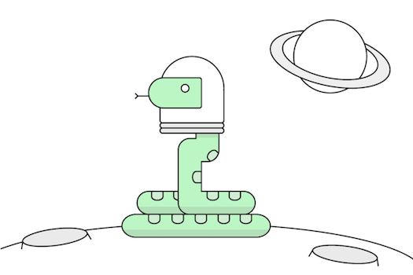
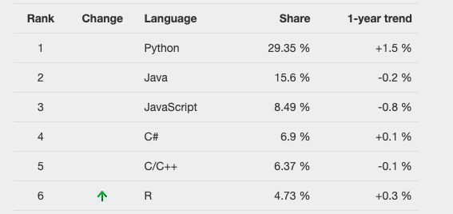
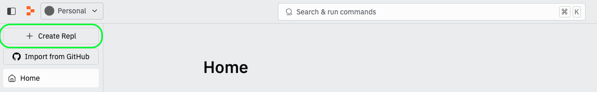
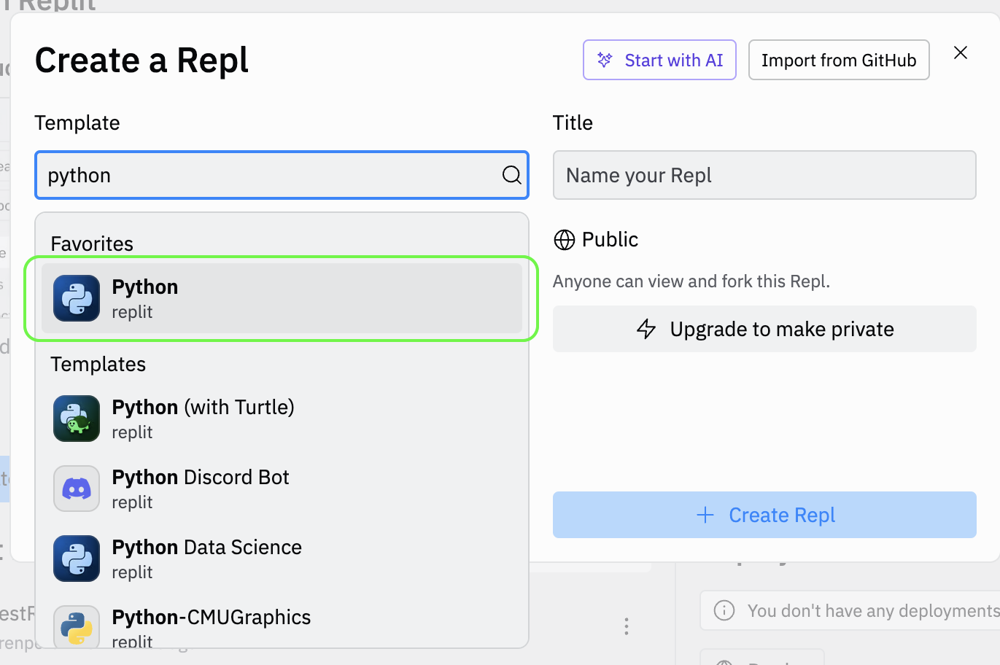
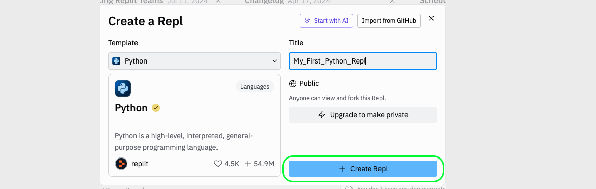
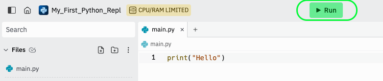
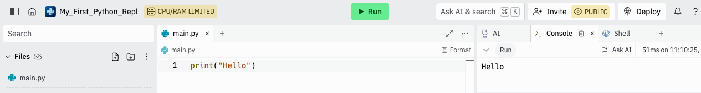
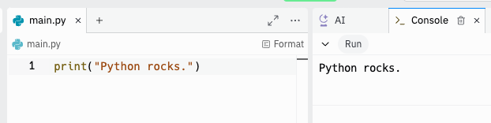

<h1>
  <span class="headline">Python Pre-Work</span>
  <span class="subhead">Introduction to Python</span>
</h1>

## Introduction to Python ( 20 min )

What is Python exactly? One meaning of the word is quite terrifying: a family of snakes found throughout Asia, Africa, and Australia that grow up to 30 feet long. The second and more relevant meaning is super awesome: a free and simple programming language named after the Monty Python sketch comedy group.

## Topics

- Python Basics
- Python History
- Python and Pseudocode

### **Learning Objectives**

By the end of this lesson, you'll be able to:

- Describe the history of Python and the pros and cons of the programming language.
- Write a basic Python script.
- Create comments.

## Where Can We Find Python in the Wild?

Python snakes are found in tropical areas. Python programs are found all over!

- **Websites:** YouTube, Instagram, and The Washington Post all rely on Python to make their sites available to millions of users.
- **File sharing:** Dropbox originally used Python for its desktop client and file-sharing mechanisms.
- **Video games:** _Civilization 4_ and _Battlefield 2_ are both written in Python.
- **Outer space:** Contractors for the U.S. space agency NASA use Python for data management in shuttle missions.

If there’s something you want to accomplish with code, Python can most likely make it happen.



## Python Fast Facts

Python is:

- Often ranked as one of — if not the — most popular programming languages on the market.
- Used in a wide variety of contexts, including tool development, process automation, mathematical calculation, data visualization, website creation, and more.
- Named after the Monty Python sketch comedy group. In fact, many Python examples and tutorials include famous jokes from Monty Python.

Check out the [interactive version](https://pypl.github.io/PYPL.html) of the worldwide popularity chart shown below.



## Want to Try It Out?

Python is focused on being "friendly," meaning it simplifies syntax and makes use of white space to promote code readability. You’ll often find that your first guess at how to do something is correct. For instance, if you want to print the word "Hello," you write: `print("Hello")`.

Let’s practice!

We can start writing Python code immediately using [Repl.it](https://replit.com/), an interactive development environment that lets us test out our program right in the browser.

### What is a Repl?

A Repl, short for Read-Evaluate-Print-Loop, is an interactive programming environment that takes single user inputs, evaluates them, and returns the result to the user. It's a great way to write and test code in real time. [Repl.it](https://replit.com/) is a popular online platform that provides this environment for many programming languages, including Python. This allows you to write, run, and share code directly from your web browser without needing to install any software on your computer.

> Note: If [Repl.it](https://replit.com/) asks you to log in, go ahead and create a free account if you haven't already.

## Say "Hello"

Let’s get started!

Navigate to your new [Repl.it](https://replit.com/) account.

Click on the `+ Create Repl` button near the top of the screen.



<br>

Search for the template called "python" and select it from the list.



<br>

Name your Repl something special like _"My_First_Python_Repl"_ and click `Create Repl`.



<br>

You'll write your code in the `main.py` file tab created for you by Repl.

Lets type a simple message:

```python
print("Hello")
```

To run your code click the `Run` button.



<br>

After you click "Run" the word `"Hello"` should appear on the right side in the `>_ Console` tab.



<br>

Look at that — you ran some code!

In computer terms, "Print" means "display on the screen," so our code displays "Hello!" in the output screen.

Don’t close this [Repl.it](https://replit.com/) window. We’ll be using it throughout this lesson.

## You’re Coding!

Awesome job! Now, you can print `Hello` to the screen.

Whenever you want your Python program to print something, you use the `print` command. If you want to `print` words, you’ll need to put them in quotes, like we did with "Hello".

Let’s try something else. In your [Repl.it](https://replit.com/), change what’s printed to instead be "Python rocks."

Your output should look like this:

```bash
Python rocks.
```

## How Did It Go?

Here’s the code you should have:

```python
print("Python rocks.")
```

So, your [Repl.it](https://replit.com/) window will look like this:



<br>

Nice work! For a last bit of practice, try changing the program to print your name.

Now, let’s learn a bit more about the Python language.

## A (Very) Brief History of Python

- **Inception: December, 1989.** A Dutch programmer named Guido van Rossum had some free time and an idea. For fun, he decided, "I’ll invent a programming language over Christmas break!"

- **Python 1: 1991.** It took a little longer than he anticipated, but Guido finally released the first iteration of Python.

- **Python 2: October 16, 2000.** Guido never stopped working and finally released Python 2. With this, his hobby started to gain traction. Suddenly, people began to recognize its value and formed a community dedicated to its development.

- **Python 3: December 3, 2008.** That community collectively built Python 3 and released it in 2008. That may seem like a long time without another major version, but, like most programming languages, Python is updated and changed regularly.

<br>


<br>

In fact, Guido still plays a central role in the language’s development and direction. The Python community awarded him the title "Benevolent Dictator for Life."

## Let’s Back Up: Python 2 vs. Python 3

As Python developers, the first question we need to ask ourselves when working on a project is: "Which version of Python is this?" The answer could be Python 2 or Python 3. Python 2 code doesn’t work in Python 3 programs, and vice versa, so it’s an important consideration!

Officially, new projects going forward are supposed to be built in Python 3. However, you’ll still see examples of Python 2 around. Why?

- Python 2 was used for more than a decade and support for it was only recently dropped, so it remains prevalent. Many programs are still written in Python 2.

- Python 2 comes pre-installed by default on Mac computers. However, we can easily install Python 3, so Mac users aren’t limited to Python 2!

Python 3 offers a lot of advantages and is the officially supported version of Python, which is why we’ll be using it throughout this course.

## Concise and Friendly

Python was invented over a Christmas break by a man who thought (correctly!) that he could create a better programming language.

With thousands of programming languages available, why did Guido feel the need to invent a new one at all?

A big reason is that Python requires a lot less typing and is more understandable than many programming languages. Some of Guido’s guiding principles for Python are that "Readability counts" and "Simple is better than complex."

## Comparing Apples to Apples

For example, let’s look at how you tell a computer to print the word "hello" on its screen.

Do you remember what you did in Python?

```python
print("hello")
```

Compared to that, here’s how you’d accomplish the same thing in a programming language called Java:

```java
public class Main {
  public static void main(String[] args) {
     System.out.println("hello");
   }
}
```

As you can see, Python is much more straightforward!

## Why Python?

How do we write more complex programs — things like video games, web browsers, or robots? Can you imagine having to do it all from scratch? How would you even begin?


Python development has always been open source, meaning anyone can contribute. Thousands of developers around the world have added useful pieces of programs that anyone else can use.

These are called **libraries**, and you can import them into any project you are working on. The next section outlines some popular libraries that demonstrate Python’s versatility.

## What If You Are Building a Program That...

### Automatically Tells You What’s on a Restaurant’s Menu

> Someone has written that for us! We can use a library called **ScraPy** to gather information from webpages.

### Calculates Complicated Math Like Calculus

> Luckily, someone has written that, too! We can use a library called **NumPy** to perform calculations for us.

### Connects to the Internet to Order Your Dinner

> Someone has done this, too! We can use a library called **Requests** to place an order on a webpage.

## The Bottom Line: Python Is Awesome

To recap, Python offers a lot of advantages over other languages. It is:

1. **Stable**, with support from a core source and a thriving community.

1. **Versatile.**

1. **User-friendly**, in that it’s easy to learn, understand, and interpret because of its clean formatting.

1. **Powerful**; a language that can handle complex problems in simple, efficient ways.

1. **Free**. Let’s not forget! Unlike some tools and languages, anyone can use Python anytime.

1. **Evolving**. Because Python is open source and has an active developer community, we can use Python to keep up with developments in the field.

These are just a few of the reasons why Python is incredibly popular!

## We Know Python Is Great, But What About Our Pseudocode?

No matter what programming language or version you use, don’t forget about pseudocode!

Pseudocode is a great way to plan out your code before you start writing it. However, if you write it in a separate document and then start coding, you may lose track of your place or forget what you’re trying to do.

Conveniently, every language has something called a **comment** you can include in your code. With comments, you can say anything you want and the computer will just ignore it.

In Python, you make a comment using the `#` symbol.

```python
# Python will ignore this line!
# We can put our pseudocode here, e.g., "Display Hello to the screen."
print("Hello")
```

Try this out in your **Repl**. Hit the `Run` arrow to see what happens!

### No Comments? No Good!

Comments are absolutely critical to include in your code.

- They allow you to keep your pseudocode in line with your actual code, so you can write your code directly below the line of pseudocode that reminds you what to do.

- Right now, we’re only printing words to the screen. Eventually, however, your code will be very complex. It’s important to leave comments in your code that explain it. This way, any other developer — or future you — can look at your code and know exactly what each line does. This is vital for working as a team!

Practice adding comments in your [Repl.it](https://replit.com/). You can put comments between lines of code and add new lines between code to keep it organized, like so:

```python
# Display "Hello" on the screen.
print("Hello")
# That's my first print statement!

# Display "Guitars are fun" on the screen.
print("Guitars are fun")
```

## Review

We’ve learned a lot in this lesson!

Remember that:

- Python is a popular, free, and user-friendly programming language.
- You will likely see Python 2 in legacy code, but Python 3 is the present and future of the language.
- We can write Python to print to the screen and add comments that Python will ignore, like so:
  - `# this is a comment`
  - `print("Hello!")`

Check out and bookmark this link for creating new Python 3 repls in [Repl.it](https://replit.com/new/python3).
