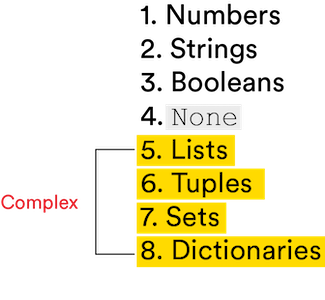

# 

## Manipulating Variables in Python ( 30 min )

Usually, whenever a tool increases in power or functionality, so does its complexity. For example, the least advanced lawn mower — a simple push mower — is made up of about 10 parts, while the most advanced one requires around 300 parts and a lot more power to make it function properly. In the tech world, Python is a wonderful exception, providing us with a tool that's both simple and powerful. In this lesson, we'll look at how Python deals with variables.

## Topics

- Python Variables
- Lists and Tuples
- Sets and Dictionaries

### **Learning Objectives**

By the end of this lesson, you'll be able to:

- Declare and use variables in Python.
- Define lists, tuples, sets, and variables along with their common methods.
- Distinguish between the complex data types.

## Variables: What Are They and Why Do We Care?

In Python, a **variable** gives you a way to label and remember different data values for quicker, neater programming.

Creating a variable in Python — which is simple to do, by the way — is like making these announcements to your computer:

- "I hereby name a variable `num_students` and assign it a value of `14`."
- "Henceforth, `teacher_pet` shall be assigned the value of `'hamster'`."

Variables store data types into the memory of your computer, allowing Python to automatically populate them into your code when you reference them later.

```python
print(num_students)
14
print(teacher_pet)
'hamster'
```

## Try it out in Repl.it!

Create a new [Repl.it](https://replit.com/new/python3) for this lesson called `Manipulating_Variables_In_Python`. As you go through this lesson, try out the examples in your Repl to see how they work.

## How Do We Create a Variable in Python?

In Python, you don't have to issue a command to create a variable. You just need the equals sign (or, in Python speak, the **assignment operator**). The equals sign **_assigns_** the value to each variable.

Once you decide what to call your variable (e.g., `teacher_pet`), enter that name followed by a single equals sign (`=`) and the data type.


<br>

For example:

- `num_cookies = 3` means we're pointing the variable name `num_cookies` to an integer with a value of `3`.

- `first_name = 'Sally'` means we're pointing the variable name `first_name` to a string with a value of `'Sally'`.

### Try it out in Repl.it!

```python
num_students = 14
teacher_pet = 'hamster'

print(num_students)
print(teacher_pet)
```

## To the Right, to the Right

When building variables, Python always evaluates the data on the **right-hand side** of the equals symbol and associates the name on the **left-hand side** with the result. While this seems overly complicated when we write something like:

```python
num_cookies = 3
```

... it's crucial when we want to do something, such as:

```python
num_cookies = 3
num_cookies = num_cookies + 1
```

In the first command, Python "sees" the number `3` and assigns that value to the variable `num_cookies`. In the second command, the value on the **right-hand side** (`num_cookies + 1`) is calculated as `4`.

Now, the value of `4` will be assigned to the `num_cookies` variable from here on out until we assign it another value.

### Try it out in Repl.it!

```python
num_cookies = 3
num_cookies = num_cookies + 1

print(num_cookies)
```

## Wait, but Why? Using Variables in Python

Now that we've declared a variable, we can use it as many times as we want wherever we want in a given program. We could use `num_cookies` in line 7 of our program and again in line 301, and it will produce the same value we assigned it at the start.

Similarly, we can use `num_cookies` 400 times throughout a program, and it will still have the same value.

This makes code a lot simpler to read and write, reduces error (especially when the variables start referencing more complex calculations), and saves a lot of time in creating code.

### Try it out in Repl.it!

```python
num_cookies = 3
print(num_cookies)

num_cookies = num_cookies + 1
print(num_cookies)

num_cookies = num_cookies + 2
print(num_cookies)
```

## Hark! A Quick Tip on Naming Your Variables

When deciding what to name any variable, you should always aim for clarity.

It's tempting to think, "Oh, I'll just remember what this is for." But we all know how well that works. (See also: that super clever password you've had to reset four times because you keep forgetting it.)

More specifically, when naming a boolean variable (one with `True` or `False` conditions), it's strongly suggested that you prefix it with `is_` or `has_` to make it easier for you and others to interpret.

Without prefixes, variable names like `appt` and `blue` aren't particularly clear. By adding prefixes, the new variable names — like `has_appt` and `is_blue` — make it clear that the value options are either `True` or `False`.

For example, `is_student_present = False`.

## But What If You Have a Lot of Similar Data Types?

Suppose we have three different types of animals that each need their own variable. Based on what we currently know, we'd need to create three separate variables:

```python
animal_type1 = 'bird'
animal_type2 = 'giraffe'
animal_type3 = 'whale'
```

As you can see, this isn't necessarily helpful — and it can get cumbersome. What if we needed a variable for every type of animal on Earth?

Python's **complex** data types help us solve this problem.



<br>

## Features of Lists

First on our list is ... lists!

Lists are:

- **Ordered:** Their elements have a particular order that will never change.
- **Heterogeneous:** Different data types can be stored for each element in the list. For example, `['cat', 10, 0.4]`.
- **Mutable:** When you alter a list, you don't create a new element — the original element is just modified.
  We can tell Python we're creating a list by wrapping the items in square brackets:

```python
animal_types = ['bird', 'giraffe', 'whale']
```

Note: It's typical to pluralize the name of a list. For example, `cars`, `animal_names`, and `cities`. This indicates that the name refers to more than one piece of data.

### Try it out in Repl.it!

```python
animal_types = ['bird', 'giraffe', 'whale']
print(animal_types)
```

## Cool Things to Do With Lists

<a href="https://generalassembly.wistia.com/medias/sqbg7v3aob?wvideo=sqbg7v3aob"></a>

_Transcript_

_Welcome to "Cool Things to Do With Lists in Python!" I’m your host Walker Junior, and I’m so glad you’re here today._

_Let’s consider: We have a list called "animal types" that contains three strings — a bird, a giraffe, and a whale. The first cool thing we’re going to do is ask Python to tell us how long our list is. We do this by using a built-in function, length(), represented by the letters "l-e-n."_

_"Hey Python? How many items are in our animal list?"_

_Cool Thing No. 2!_

_We can access any item within a list using indexing. This is represented by square brackets. Indexing starts with "0," so the first item in any list is the 0th item. So, if we asked Python, "Hey, what is the first variable in our list?", it would return "Bird."_

_Cool!_

_What about the third item in our animal list? Ah, the third item is "whale."_

_Cool Thing No. 3!_

_We can ask, "Hey Python, you know that list of animals we made? Well, replace the first element with ‘cat.’" So, if we ask Python to show us our new list using the print function. It will return our updated list with the new 0th item._

_And this concludes our list of cool things to do with lists in Python._

_We hope you enjoyed it as much as we did._

### Try it out in Repl.it!

```python
animal_types = ['bird', 'giraffe', 'whale']
print(len(animal_types))

print(animal_types[0])
print(animal_types[2])

animal_types[0] = 'cat'
print(animal_types)
```

## More Cool Things to Do With Lists: Append and Pop

There will be times when we want to do more than just learn how long a list is or which item comes third.

What if we want to add or remove items from a list? That's where our dear friends `append()` and `pop()` help out.

`append()` adds an item to the end of a list.

```python
animal_types = ['cat', 'giraffe', 'whale']
animal_types.append('turkey')
```

After evaluating both lines, `animal_types` now contains four elements: `['cat', 'giraffe', 'whale', 'turkey']`.

But what if we decide we don't like turkey after all?

`pop()` removes an element from a list. You can provide it the specific index to remove, or else it will default to removing the last element from the list.

```python
animal_types = ['cat', 'giraffe', 'whale', 'turkey']
animal_types.pop()
```

`animal_types` now contains the original three elements: `['cat', 'giraffe', 'whale']`.

### Try it out in Repl.it!

```python
animal_types = ['cat', 'giraffe', 'whale']
animal_types.append('turkey')
print(animal_types)

animal_types.pop()
print(animal_types)
```

## Pro Tip: Google It

There are a lot of methods and actions you can take in Python. Sometimes, even the most experienced programmers have to look things up.

Don't know what the answer is? Google it.

If you encounter a method you haven't seen before, copy and paste it into the Google search bar to find out what it does. If you don't know the name of the method for a task you want to accomplish, run a Google search and you'll definitely find it.

Google can be your best coding buddy, and it's both valuable and rewarding to practice finding things you don't know or remember.

## Next Up: Tuples

Aside from being fun to say (TOO-pulls!), tuples are similar to lists in that you can store multiple values. However, there's one huge difference: Tuples are **immutable** — you can't alter a tuple element once it's been created.

In other words, we can't do as many cool things with tuples as we can do with lists. Methods like `append()` and `pop()` won't work.

To define a new tuple, use parentheses instead of brackets:

```python
days_of_week = ('Monday', 'Tuesday', 'Wednesday', 'Thursday', 'Friday', 'Saturday', 'Sunday')
```

(_Tuples_. _Tuples_. _Tuples_. Fun, right?)

### Try it out in Repl.it!

```python
days_of_week = ('Monday', 'Tuesday', 'Wednesday', 'Thursday', 'Friday', 'Saturday', 'Sunday')
print(days_of_week)
```

## Why Use a Tuple When We Have Lists?

Tuples are used for information that won't change: the days of the week, the months in a year, the configuration settings of an application, the fixed options in a dropdown menu on a form, and more.

Because they're immutable, they can't accidentally be overwritten. Additionally, because tuples have fixed sizes (determined when they're assigned initial values), they're more memory-efficient than a list, which needs additional memory allocated to it.

If you won't be changing your data, a tuple may be a better choice.

## Moving On: Sets

A **set** is a collection of unordered, **unique** elements. For example, let's say you and I traveled to different places around the world. The data we're trying to capture is where we each went — the sequential order doesn't matter.

```python
my_places_traveled = {'Riyadh', 'Jeddah', 'Bahrain'}
your_places_traveled = {'Singapore', 'Riyadh'}
```

The particular order inside the set doesn't matter, as each place was either visited or not.

To tell Python we're writing a set, we use curly braces `{ }`.

### Try it out in Repl.it!

```python
my_places_traveled = {'Riyadh', 'Jeddah', 'Bahrain'}
your_places_traveled = {'Singapore', 'Riyadh'}

print(my_places_traveled)
print(your_places_traveled)
```

## But We Have Lists and Tuples. Why Sets?

Lists and tuples are the bee's knees, but sets have their charms too. For one thing, computers can more efficiently check to see if an element is in a set. We call this "membership lookup." It takes a lot more energy to search lists in the same way.

Taking advantage of sets means your program runs faster and uses less memory. If you don't have duplicates and you don't need order, use a set.

To check whether an element is in a set, we use the `in` operator.

```python
'Riyadh' in my_places_traveled
True
```

### Try it out in Repl.it!

```python
my_places_traveled = {'Riyadh', 'Jeddah', 'Bahrain'}
print('Riyadh' in my_places_traveled)
print('Singapore' in my_places_traveled)
```

## And Now, Dictionaries

Think about a dictionary in real life (not programming life). It's a big old book — or website — with words and definitions that are paired together and easily searchable.

Dictionaries in programming work just like that. They hold **keys** (words) and **values** (their definitions). This means a term can be stored with specific attributes.

For example:

- Names could be paired with ages.

- Months could be paired with the number of days in a month.

- Book titles could be paired with authors.

Let's look at how to create dictionaries, as well as some common use cases.

## How Key-Value Pairs Work in Dictionaries

As with sets, a dictionary is defined using curly braces. However, each element of a dictionary consists of a **key**, followed by a **colon**, then by a **value**.

Check out this example of a dictionary that pairs book titles with their authors:

```python
book_authors = {'Moby Dick': 'Herman Melville', 'The Lorax': 'Dr. Seuss', 'The Hobbit': 'J.R.R. Tolkien'}
```

This is a container of what we call **key-value pairs**. Thus, if we asked Python how many items were in the `book_authors` dictionary using `len(book_authors)`, it would return `3`, as there are three key-value pairs.

**Pro Tip:** To create an empty set, use the built-in `set()` function (e.g., `untasty_fruits = set()`). Why? Because in Python, curly braces are used for both sets and dictionaries. Empty braces `{}` indicate an empty dictionary.

### Try it out in Repl.it!

```python
book_authors = {'Moby Dick': 'Herman Melville', 'The Lorax': 'Dr. Seuss', 'The Hobbit': 'J.R.R. Tolkien'}
print(book_authors)
print(len(book_authors))
```

## Cool Things We Can Do With Dictionaries

To make any changes to an existing dictionary, you need to work with the key. This is the same as in a physical dictionary — we use a word to look up its definition, not the other way around.

To create a new key-value pair, we would write:

```python
book_authors['The Great Gatsby'] = 'F. Scott Fitzgerald'
```

If `['The Great Gatsby']` already exists as a key in our dictionary, the above would update the value to `'F. Scott Fitzgerald'`.

To access the value of a particular key, we would write:

```python
book_authors['The Lorax']
```

... which would return `Dr. Seuss`.

### Try it out in Repl.it!

```python
book_authors = {'Moby Dick': 'Herman Melville', 'The Lorax': 'Dr. Seuss', 'The Hobbit': 'J.R.R. Tolkien'}
book_authors['The Great Gatsby'] = 'F. Scott Fitzgerald'

print(book_authors)
print(book_authors['The Lorax'])
```

## Review: Container Data Types

The handy chart below summarizes the properties of the data types we just covered: the built-in containers available in Python.

|                         | Lists | Tuples | Sets | Dictionaries    |
| ----------------------- | ----- | ------ | ---- | --------------- |
| Container               | Yes   | Yes    | Yes  | Yes             |
| Ordered                 | Yes   | Yes    | -    | -               |
| Immutable               | -     | Yes    | -    | -               |
| Elements Must Be Unique | -     | -      | Yes  | Yes (keys only) |
| Fast Membership Lookups | -     | -      | Yes  | Yes (keys only) |

## Review

We use variables to temporarily store and remember things so we can reference them later. To use a variable, we give it a name and assign a value to it using the assignment operator.

When we have multiple values we want to assign to variables, we use the more complex data types: lists, tuples, sets, and dictionaries.

<br>

<hr>

<a href="./assets/manipulating-variables-in-python.pdf" target="_blank" download="manipulating-variables-in-python.pdf" class="ant-btn" data-trackable="true" data-track-category="study guide" data-track-section="lesson page" data-track-action="download study guide"><span role="img" class="anticon"><svg viewBox="0 0 16 16" width="1em" height="1em" fill="currentColor" aria-hidden="true" focusable="false" class=""><g class="download_svg__nc-icon-wrapper"><path d="M8 12c.3 0 .5-.1.7-.3L14.4 6 13 4.6l-4 4V0H7v8.6l-4-4L1.6 6l5.7 5.7c.2.2.4.3.7.3z"></path><path data-color="color-2" d="M1 14h14v2H1z"></path></g></svg></span><span> Download Study Guide</span></a>

<br>
