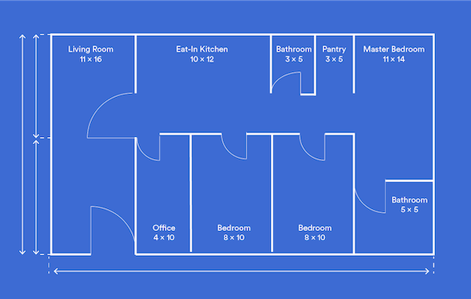
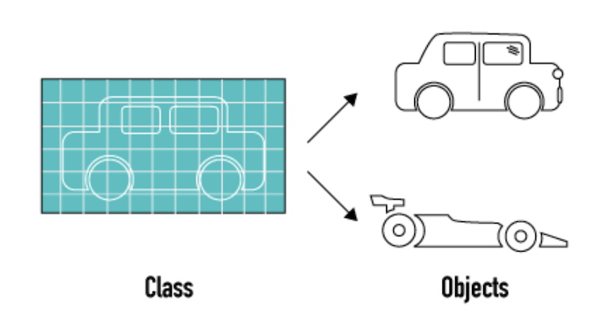
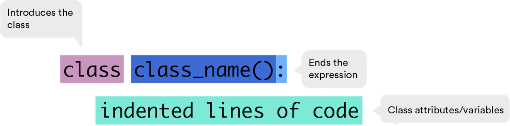
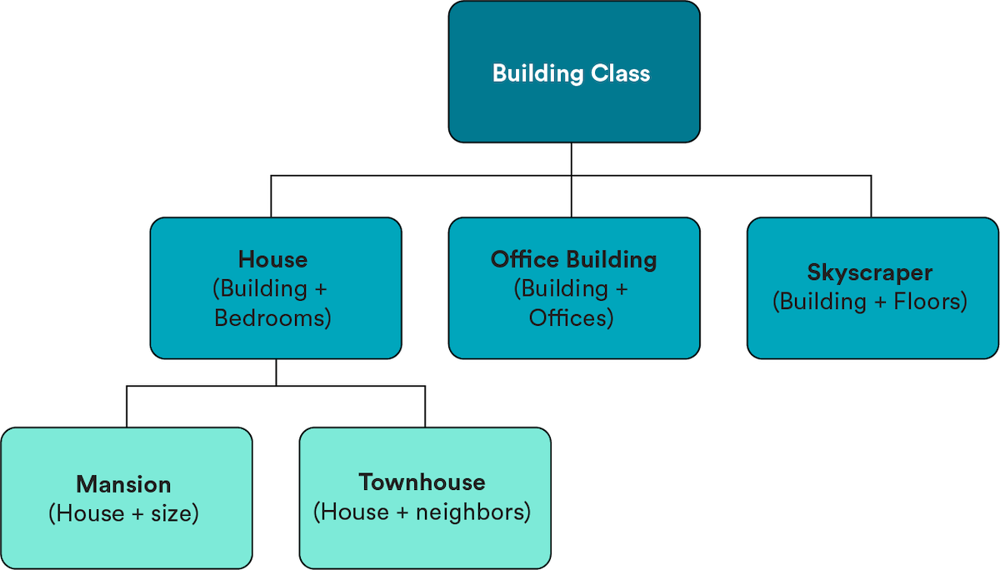

<h1>
  <span class="headline">Python Pre-Work</span>
  <span class="subhead">Objects and Classes</span>
</h1>

## Objects and Classes ( 30 min )

A minivan, a race car, and a pickup truck walk into a bar... wait, wrong story! A minivan, a race car, and a pickup truck each have a different purpose, perform different functions, and have different design specifications. BUT they are all cars. In Python, you can build multiple different objects from a single blueprint called a class. In this lesson, we’ll show you how classes work.

## Topics

- Defining Classes
- The "Self" Argument
- Instantiating Classes

### **Learning Objectives**

By the end of this lesson, you'll be able to:

- Create an object from a class using instantiation.
- Pass instance methods and variables to objects using the "self" argument.

## What’s An Object?

An `object` is anything that can be 1) assigned to a variable and 2) passed to a function as an argument. Lists, strings, integers, dictionaries — and even functions themselves — are all objects.

In this lesson, you’re going to learn how to define the "blueprint" of an object, known as a `class`. Then, we’ll look at how to create an object based on that blueprint through a process called `instantiation`.



<br>

## Classes

`Classes` define the overall structure of an object. They’re the blueprints that tell our program what to include in an object.

Our car blueprint, for example, would tell us to include things such as wheels, doors, and a windshield. It would also include functions, such as the ability to drive, brake, and park.

These attributes would be included in all cars. We’ll get into the specifics of how they’re included a little bit later.



<br>

## How to Define a Class in Python

Defining a class is similar to defining a function — only, instead of `def`, we use `class`, followed by a name, parentheses, and a colon.

Inside the class we can have **attributes** (pieces of information or variables) and **methods** (actions).



<br>

## Try it out in Repl.it!

Create a new [Repl.it](https://replit.com/new/python3) for this lesson called `Objects_And_Classes`. As you go through this lesson, try out the examples in your Repl to see how they work.

## Food for Thought

<a href="https://generalassembly.wistia.com/medias/4b2vpn91qv?wvideo=4b2vpn91qv"></a>

_Transcript_

_What do you think of when you think of a sandwich? You take some bread and then add some meat, vegetables, and cheese in between it, and bam — sandwich._

_It’s a simple blueprint that can create all sorts of things — the hamburger, a veggie wrap, and even this monstrosity of cereal and frosting in between two chicken breasts._

_All of these follow the basic format and are technically considered sandwiches. In Python, we use classes to set this same kind of template for our objects._

_We can then use properties to define what’s in them and actions to tell them what to do._

_Why is this so good?_

## But First: Instantiation!

In programming, **instantiation** is the creation of a particular manifestation of your class (these are known as **instances**).

So, a race car would be one instance of our "car" class, minivans would be another, etc.

Each variation of our class will have its own name and defining characteristics.

## A Chip Off the Code Block

Exactly _how_ does an object inherit stuff from its class?

Well, there are two critical components to the instantiation process:

- `__init__()` is a Python method that initializes the attributes of a particular class. Every time we want to create a new instance of an object, we use the `__init__()` method. It basically says,

  "Hey! Every time you make an object from this class, make it with what’s in here."

- The `self` keyword refers to the instance of the object itself. It’s what binds the attributes to the object.

```python
class ClassName():

    def __init__(the stuff the object should include):
```

## Using the "Self" Keyword

Let’s start building out our `Car` class and include the beginnings of the `**init**()` method:

### Try it out in Repl.it!

```python
class Car(object):
    def __init__(self, doors, wheels, windshield):
        self.doors = doors
        self.wheels = wheels
        self.windshield = windshield
    def drive(self):
        print ("I am driving")
```

The first argument passed to the method, `self`, is **required**. It is a reference to a future instantiation of the class.

The other arguments (`doors`, `wheels`, and `windshield`) tell Python that every car object we make from the `Car` class will include those attributes.

The `def drive()` method tells Python that every object made from this class can drive.

## Instantiating a Sedan

Let’s try to instantiate a sedan object.

To create a sedan, we use the `Car` class and pass in the specific details of the sedan we want to create.

### Try it out in Repl.it!

```python
class Car(object):
    def __init__(self, doors, wheels, windshield):
        self.doors = doors
        self.wheels = wheels
        self.windshield = windshield
    def drive(self):
        print ("I am driving")

sedan = Car(4, 4, 2)
```

Notice that, once again, the first argument is `self`. In attributes defined within a class, the `self` argument always comes first. When creating an instance attribute, you don’t need to explicitly provide the `self` argument to the function — Python automatically fills it in.

## Instantiating a Coupe in Code

Now let’s switch gears (get it?) from a sensible four-door sedan to a sleek coupe.

```python
class Car(object):
    def __init__(self, doors, wheels, windshield):
        self.doors = doors
        self.wheels = wheels
        self.windshield = windshield
    def drive(self):
        print ("I am driving")

coupe = Car(2, 4, 2)
```

All of the code stays the same, except the last line where we declare the coupe and designate the number of doors, wheels, and windshields. Crazy easy, right?

## Let’s Build Something Besides Cars

Let’s try this with another class: buildings.

In our `Building()` class, we have attributes for the number of square feet, rooms, and bathrooms. We also have two methods — one to print the attributes out in `describe_building()` and one to calculate the price and return it based on the attributes in `get_price()`.

### Try it out in Repl.it!

```python
class Building():
    def __init__(self, sqft, rooms, bathrooms):
        self.sqft = sqft
        self.rooms = rooms
        self.bathrooms = bathrooms

    def describe_building(self):
        print('Rooms:', self.rooms)
        print('Baths:', self.bathrooms)
        print ('Sq. Ft.:', self.sqft)

    def get_price(self):
        price = self.sqft*5 + self.rooms*15000 + self.bathrooms*15000
        return price
```

We can instantiate a `Building()` object using this class and use the instance methods as defined within it:

```python
my_building = Building(1200, 6, 2)
my_building.sqft
# 1200

my_building.get_price()
# 126000
```

## A House Is a Building... Right?

Let’s say we want to create another `class` for houses.

Instead of starting from scratch, we can inherit attributes from the `Building()` class we’ve just created, using a process called —wait for it — _inheritance_. Every house has the same attributes as a building, but they also have house-specific attributes, such as the number of bedrooms.

In order to implement **inheritance**, we’ll want to inherit all of the attributes of the `Building()` class and then extend them with the `House()` _child class_. In this case, our child class, `House()`, has an `__init__()` method and so does `Building()`.

Because we want to inherit the attributes from the `Building()` class, we need to call its `__init__()`. We can do so using the built-in `super()` function. `super.__init__()` calls the building’s `__init__` method. Basically, the built-in `super()` function is a way for us to call a method on a parent class.

```python
class House(Building):
   def __init__(self, sqft, rooms, bathrooms, bedrooms):
      super().__init__(sqft, rooms, bathrooms)
      self.bedrooms = bedrooms
```

## Hierarchy

Using inheritance, you can also create **hierarchies**. These keep your code clean and intuitive.

Inheritance is an extremely powerful feature of classes. It allows us to create "generic" parent classes, such as `Building()`, as well as create child classes, such as `House()`, that represent subsets of the parent class.

When we define the `House()` class, we can add characteristics (such as the number of bedrooms) but, because this class inherits from `Building()`, we’re still able to use the parent attributes (number of walls, bathrooms, etc.) and methods (`describe_building()` and `get_price()`).

We don’t need to rewrite these methods in the child class, so our code is more concise.



<br>

## Overwriting Inherited Attributes in a Child Class

We can also overwrite attributes and methods inherited from the parent class.

Say the formula for the price of a `House()` was different, in general, than the formula for the price of a `Building()`. By redefining the `get_price()` method for the `House()` class, we can change the behavior from its parent class.

### Try it out in Repl.it!

```python
class House(Building):

    def __init__(self, sqft, rooms, bathrooms, bedrooms):
        super().__init__(sqft, rooms, bathrooms)
        self.bedrooms = bedrooms

    def get_price(self):
        price = self.sqft*5 + self.bedrooms*20000 + self.bathrooms*10000
        return price

my_building = Building(2000, 3, 4)
# 115,000

my_house = House(2000, 10, 3, 4)
# 120,000
```

## Class Variables vs. Instance Variables

One last note about classes: you can define _class_ variables that belong to the class itself, and not to any instances generated by the class. In general, variables assigned with `self` will be _instance_ variables, and variables assigned without `self` and outside of any method will be _class_ variables.

It’s up to you to decide which is more appropriate for what you’re doing — but FYI, instance variables are used more frequently than class variables.

### Try it out in Repl.it!

```python
class Traveler(object):
    continents = ['North America','South America','Asia','Europe','Africa','Antarctica','Australia']  # a class variable

    def __init__(self, name='Fred', visited=['Asia','Europe']):
        self.name = name  # instance variable
        self.visited = visited  # instance variable
```

In the code above, we have a class for a `Traveler()`. The list of continents is a class variable and thus not shared across instances. Instead, it belongs to the class itself, not individual instances created by the class. However, name and continents visited are instance variables and therefore specific to each `Traveler()` object created.

## Review

**Classes** are blueprints from which we can make multiple, similar objects. This keeps us from having to repeat ourselves.

Classes contain attributes (pieces of information or variables) and methods (actions).

The `__init__()` method initializes the attributes of a particular class. Every time we want to create a new instance of an object, we use the `__init__()` method. It basically says, "Hey! Every time you make an object from this class, make it with what’s in here."

Classes and objects can be more than one generation deep, as in our "building, house, townhouse" example.


<br>

<hr>

<a href="./assets/objects-and-classes.pdf" target="_blank" download="objects-and-classes.pdf" class="ant-btn" data-trackable="true" data-track-category="study guide" data-track-section="lesson page" data-track-action="download study guide"><span role="img" class="anticon"><svg viewBox="0 0 16 16" width="1em" height="1em" fill="currentColor" aria-hidden="true" focusable="false" class=""><g class="download_svg__nc-icon-wrapper"><path d="M8 12c.3 0 .5-.1.7-.3L14.4 6 13 4.6l-4 4V0H7v8.6l-4-4L1.6 6l5.7 5.7c.2.2.4.3.7.3z"></path><path data-color="color-2" d="M1 14h14v2H1z"></path></g></svg></span><span> Download Study Guide</span></a>

<br>
